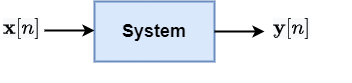
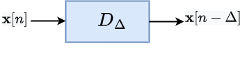
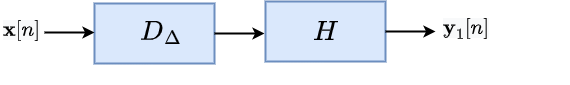
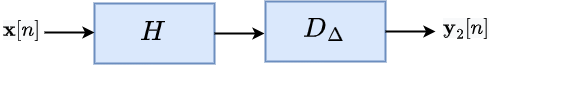
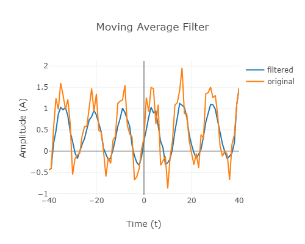

# Theory #
## Signals and Systems ##
In this experiment we will look at discrete-time systems which are linear and time-invariant, i.e., LTI systems. A block diagram representation of a general system is shown below. 

  

The input signal to the system is $\textbf{x}[n]$ and output generated by the system is denoted by $\textbf{y}[n]$. Above is a black box representation of a system. As an example, consider a system which delays the input signal by an amount $\Delta$ generating the output signal $\textbf{y}[n] = \textbf{x}[n- \Delta]$. A schematic of such a system is shown below.    

  

We may not always know the exact inner working of the system, but it is possible to characterize systems using some properties they may possess. Two such important properties are linearity and time-invariance. 

## Linearity and time-invariance ##

### Linearity 
 A system is said to be linear if a superposition of input signals generates the same superposition of corresponding output signals. Let $H$ by a system which produces outputs $\textbf{y}_1[n]$ and $\textbf{y}_2[n]$ for input signals $\textbf{x}_1[n]$ and $\textbf{x}_2[n]$ respectively. If $\alpha$ and $\beta$ are any arbitrary constants, then the system $H$ is said to be linear if the input signal $\alpha \textbf{x}_1[t] + \beta \textbf{x}_2[t]$ produces the output $\alpha \textbf{y}_1[t] + \beta \textbf{y}_2[t]$. 

$$ \text{If} ~\textbf{x}_1[n] \rightarrow \textbf{y}_1[n]~ \text{and}~ \textbf{x}_2[n] \rightarrow \textbf{y}_2[n],$$ 
  
$$ \text{then}, \text{Linearity} \Rightarrow  \alpha \textbf{x}_1[n] + \beta \textbf{x}_2[n] \rightarrow \alpha \textbf{y}_1[n] + \beta \textbf{y}_2[n]$$ 

The delay system above is an example of a linear system. 

Examples of linear and non-linear systems. 

### Time-invariance  ###
 A system $H$ is said to be time-invariant if the system behaviour does not change with time. Specifically, if the input signal is delayed by some amount, then the output is also delayed by the same amount. Equivalently, this means that the following two systems have same output, i.e., $\textbf{y}_1[n] = \textbf{y}_2[n]$, when the input signal is the same. 

   

  

   From above, if the cascading order of the delay system $D_{\Delta}$ and the system $H$ does not change the output, then the system $H$ is said to be a time-invariant system.  

It is easy to verify that the delay system itself is an example of a time-invariant system. 

Examples of time-invariant and time-variant systems. 

Systems which possess both the properties of linearity & time-invariance are called LTI systems. 

## Impulse response ##

Impulse response is the output of a system when input is an impulse signal i.e. $\delta [n]$, 

$$ \delta[n] = \left\{\begin{matrix}
1 \quad ~~~~~~n=0 \\ 
0 \quad \text{otherwise}
\end{matrix}\right. $$

The above impulse is also known as Kronecker delta signal. For LTI systems, output of the system to any arbitrary signal input can be determined from the impulse response using the convolution operation. If $\textbf{h}[n]$ is the impulse response of the system $H$ and the input signal is $\textbf{x}[n]$, the output is given by 

$$\textbf{y}[n] = \textbf{x}[n] * \textbf{h}[n] = \sum_{-\infty}^{\infty} \textbf{x}[m] \textbf{h}[n-m] $$

### Impulse response of some standard systems: ###
 * Delay: $\textbf{h}[n] = \delta [n - \Delta]$
 * Scaling:  $\textbf{h}[n] = \alpha \delta [n]$  
 * Differentiator: $ \textbf{h}[n] = \delta [n] - \delta [n-1] $   
 * Accumulator: $\textbf{h}[n] = u[n] = \left\{\begin{matrix}
1 \quad n\geq 0 \\ 
0 \quad n<0
\end{matrix}\right.$

 * Identity system: $h[n] = \delta [n]$

 ## Step response ##
Step response is the output of a system when the input is the step signal ${u}[n]$. If $\textbf{h}[n]$ is the impulse response of system $H$, then from above theory, the step response $\textbf{s}[n]$ is given by convolution of $\textbf{h}[n]$ with ${u}[n]$, 

$$\textbf{s}[n] = {u}[n] * \textbf{h}[n] = \sum_{m=-\infty}^{m=n} \textbf{h}[n-m] $$

Thus, for a delay system with impulse response $\textbf{h}[n] = \delta [n - \Delta]$, its step response will be $\textbf{s}[n] = u[n - \Delta]$. 

 ## LTI system application – moving average ##
LTI systems have been useful in a number of applications including audio and speech signal processing. A very basic requirement of such systems is to perform noise removal. Typically, a noisy signal consists of a rapidly fluctuating noise component and a signal component with relatively slow fluctuations. For example, consider the sinusoidal signal burried in noise 
$$ x[n] = \sin(\omega_0 n) + w[n]  $$

where $w[n]$ is the noise component. Since the rate of fluctuations of the noise and signal components are different, this can be used to selectively reduce the noise. We demonstrate how this can be achieved using a simple moving average system. A moving average system simply computes an average of $M$ samples around the given point. As expected, this can reduce the rapid fluctuations in the noise component with relatively smaller impact on the slowly changing signal component. An $M$-length moving average system has impulse response given by 
$$\textbf{h}[n] = u[n] = \left\{\begin{matrix}
1 \quad n\geq 0 \\ 
0 \quad n<0
\end{matrix}\right.$$

When the input signal is $x[n]$, the output of this system is given by  

$$y[n] = \sum_{k = -M/2}^{k = M/2} x[n+k] $$

An example of a noisy signal x[n] and the signal obtained after passing it through a moving average system of length $M = 5 $ is shown below. 

  

As can be seen, the noise has reduced in the output signal. 

